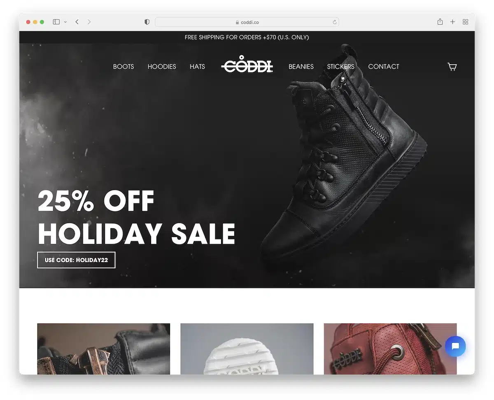

# Shoes Website Front-End Practice Project

## Description

This repository contains a front-end practice project for building a simple online shoe store website called CODDI. In this project, I had the opportunity to practice my front-end development skills by creating a visually appealing and responsive(later) website.

## Features

- **Animations**: Implemented Animations for Loading Images.

## Technologies Used

- HTML
- SCSS
- React

## Getting Started

1. Clone this repository to your local machine.
2. Open the project in your preferred code editor.
3. Run `npm i`.
4. Run the website with `npm run dev`.

## Showcase

Here's a screenshot of the CODDI website:

Feel free to fork and expand upon this front-end project to further enhance your skills. Happy coding!

